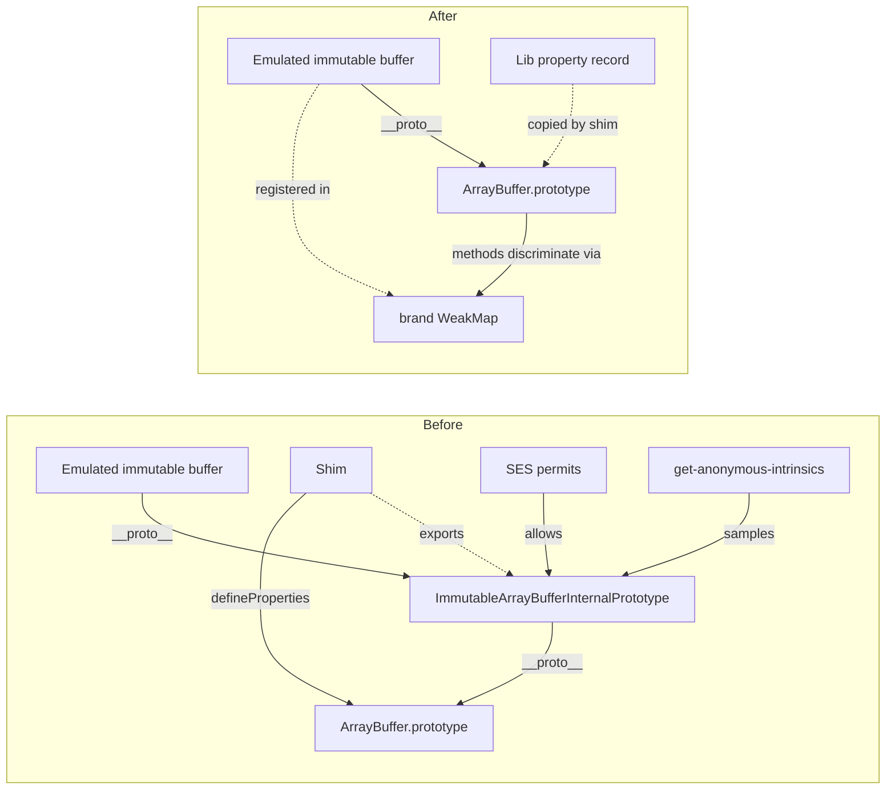

# Drop the pseudo-prototype: collapse the immutable-ArrayBuffer lib onto `ArrayBuffer.prototype`

This design captures the *drop-the-pony* redesign erights proposed
on the experiment branch's predecessor pull request (referenced in
the comment whose identifier appears in the project log).
The package keeps its split between a self-contained library layer (today's pony layer)
and a shim layer that installs immutable-ArrayBuffer support onto the
genuine `ArrayBuffer.prototype` at load time.
The redesign changes what the library layer exports and what the shim
does with those exports, not the package's split-into-two-layers shape.

## Status

| Field    | Value                                                                                       |
| -------- | ------------------------------------------------------------------------------------------- |
| Created  | 2026-06-09                                                                                  |
| Authors  | erights (original framing), kriscendobot (write-up)                                         |
| Status   | Proposed                                                                                    |
| Affects  | `packages/immutable-arraybuffer/`, `packages/ses/src/permits.js`, `packages/ses/src/get-anonymous-intrinsics.js` |
| Replaces | The intermediate `%ImmutableArrayBufferPrototype%` intrinsic introduced by the cycle-201 shim |

## Problem

Today, `@endo/immutable-arraybuffer` emulates immutable ArrayBuffers by
constructing instances whose direct prototype is an intermediate object
named `ImmutableArrayBufferInternalPrototype`.
That intermediate prototype inherits from `ArrayBuffer.prototype` and
overrides every method and accessor (`byteLength`, `slice`, `transfer`,
`resize`, and so on) so they consult a `WeakMap`-emulated private field
and either delegate to the underlying genuine buffer or throw the
appropriate "cannot mutate" `TypeError`.
The shim then adds three brand-new properties (`sliceToImmutable`,
`transferToImmutable`, `immutable`) to the genuine `ArrayBuffer.prototype`
so that any genuine ArrayBuffer can be converted to an emulated
immutable one.

This shape forces three load-bearing artifacts that have no analog in
the proposal as natively implemented:

- The intermediate prototype.
  Every emulated immutable buffer has a direct prototype distinct from
  `ArrayBuffer.prototype`.
  SES samples that intermediate prototype at lockdown time via the
  throwaway-instance prototype walk in `get-anonymous-intrinsics.js`
  and registers it as the `%ImmutableArrayBufferPrototype%` intrinsic.
- The `permits.js` `%ImmutableArrayBufferPrototype%` entry.
  A twenty-line block enumerating every property of the intermediate
  prototype that the lockdown phase is allowed to keep.
- The two-surface story.
  Code that reads the package's README has to learn two surfaces:
  the ponyfill (functions that take a buffer argument) and the shim
  (methods on the genuine prototype).
  The two surfaces also disagree about the *call shape* of the same operation:
  `sliceBufferToImmutable(buf, start, end)` versus
  `buf.sliceToImmutable(start, end)`.

The redesign collapses all three.
The library layer stops exporting ponyfill functions and instead exports a record of properties.
The shim copies that record's own-properties onto `ArrayBuffer.prototype` and
`%TypedArrayPrototype%` (the parallel TypedArray side lands on
`%TypedArrayPrototype%` once the freezable TypedArray work merges; see
*Out of scope* for this design's relationship to that work).
Emulated immutable buffers are still created by the lib (they still need a
distinct identity so a brand-check WeakMap can recognise them), but
they no longer have a distinct prototype: their `__proto__` is
`ArrayBuffer.prototype` directly, and the methods that already live on
that prototype (the genuine ones plus the shim-installed ones)
discriminate on whether `this` is in the brand-check WeakMap.

The discriminator is the *amplifier-with-this-fallthrough* pattern: a
brand-check function that returns the underlying genuine buffer if the
receiver is in the WeakMap, and returns the receiver itself otherwise.
The predecessor experiment branch already uses this pattern for
freezable TypedArrays (commit `e02ec0d08`) and erights has signaled it
as the preferred shape for ArrayBuffer too.

## Design

The redesign has five moves.
Each is described below as the diff from master (`4a04d078b`).

### Move 1: Rename "pony" to "lib"

Every occurrence of "pony" in `packages/immutable-arraybuffer/`
filenames, identifiers, exported symbols, JSDoc, test titles, and
README prose becomes "lib".

| Before                                                       | After                                                       |
| ------------------------------------------------------------ | ----------------------------------------------------------- |
| `src/immutable-arraybuffer-pony.js`                          | `src/immutable-arraybuffer-lib.js`                          |
| `test/immutable-arraybuffer-pony-slice.test.js`              | `test/immutable-arraybuffer-lib-slice.test.js`              |
| `test/immutable-arraybuffer-pony-transfer.test.js`           | `test/immutable-arraybuffer-lib-transfer.test.js`           |
| `index.js`: `export * from './src/immutable-arraybuffer-pony.js';` | `export * from './src/immutable-arraybuffer-lib.js';` (but see *Move 3* for whether `index.js` is reachable as a public export) |
| README heading `## The Ponyfill`                             | `## The Lib Layer`                                          |
| README prose "the ponyfill and shim"                         | "the lib layer and shim"                                    |
| Test title `'Immutable ArrayBuffer ponyfill installed and not hardened'` | `'Immutable ArrayBuffer lib installed and not hardened'` |

Identifiers internal to the lib file that contain "ponyfill" or "pony"
in their JSDoc are rewritten.
The exported symbol names (`isBufferImmutable`, `sliceBufferToImmutable`,
`optTransferBufferToImmutable`) are *not* themselves renamed in this
move because they are already lib-neutral; see *Move 3* for whether
they remain exported at all.

In `packages/bytes/src/to-immutable.js`, the JSDoc reference to "the
ponyfill" is rewritten to "the lib layer", with the caveat that this
file's import may be retired entirely under *Move 3's* premise-2
question.

The historical `CHANGELOG.md:18` entry ("sliceToImmutable Hermes
ponyfill and shim") is left as a historical artifact (see *Open
questions* for the call).
Historical changelog text describes what was shipped at the time and is
not retroactively rewritten when terminology moves.

### Move 2: Amplifier-with-this-fallthrough extends to ArrayBuffer

The lib's `getBuffer` (today's `immutable-arraybuffer-pony.js:97-105`)
gains the fallthrough behaviour:

```js
// Before (throws on non-emulated input):
const getBuffer = immuAB => {
  const result = buffers.get(immuAB);
  if (result) return result;
  throw TypeError('Not an emulated Immutable ArrayBuffer');
};

// After (returns the receiver on fallthrough, so the method becomes
// a drop-in replacement for the genuine method when invoked on a
// genuine ArrayBuffer):
const amplifyArrayBuffer = buffer => {
  const result = buffers.get(buffer);
  if (result !== undefined) return result;
  return buffer;
};
```

The parameter name changes from `immuAB` to `buffer` to reflect that the
fallthrough path is no longer an error: the function now accepts either
an emulated immutable or a genuine `ArrayBuffer` and returns the buffer
the caller should operate on.

The name change (`getBuffer` to `amplifyArrayBuffer`) aligns with the
analogous `amplifyTypedArray` on the experiment branch.
Every method on the (formerly pseudo-)prototype uses
`amplifyArrayBuffer(this)` as the way to reach the underlying buffer
for read operations, and the four mutator methods (`resize`, `transfer`,
`transferToFixedLength`, `transferToImmutable`) check membership in the
brand WeakMap to decide whether to throw the "cannot mutate" error or
delegate to the genuine method.

Concretely, the methods restructure as follows.
The read accessors and the `slice` family become straight delegation
(the body looks the same whether `this` is emulated-immutable or a
genuine ArrayBuffer, because `amplifyArrayBuffer` returns the right
underlying buffer either way):

```js
get byteLength() {
  return apply(arrayBufferByteLength, amplifyArrayBuffer(this), []);
},
slice(start = undefined, end = undefined) {
  return arrayBufferSlice(amplifyArrayBuffer(this), start, end);
},
```

`arrayBufferSlice` is the lib's internal `apply(slice, realBuffer, [start, end])`
wrapper around the captured genuine `ArrayBuffer.prototype.slice`; it remains in
`src/lib.js` after this redesign, used by both the `slice` and `sliceToImmutable`
methods on the prototype record.

The mutators discriminate on brand membership and delegate to the
genuine method on fallthrough.
The genuine methods are captured at module load time before any shim
installation can shadow them:

```js
// At module top, after the existing `slice, transfer: optTransfer`
// destructure:
const { resize: optResize, transferToFixedLength: optTransferToFixedLength } =
  arrayBufferPrototype;

// In the prototype record:
resize(newByteLength = undefined) {
  if (buffers.has(this)) {
    throw TypeError('Cannot resize an immutable ArrayBuffer');
  }
  if (optResize === undefined) {
    throw TypeError(
      'Cannot resize ArrayBuffer: underlying platform lacks ArrayBuffer.prototype.resize',
    );
  }
  return apply(optResize, this, [newByteLength]);
},
transfer(newLength = undefined) {
  if (buffers.has(this)) {
    throw TypeError('Cannot detach an immutable ArrayBuffer');
  }
  if (optTransfer === undefined) {
    throw TypeError(
      'Cannot transfer ArrayBuffer: underlying platform lacks ArrayBuffer.prototype.transfer',
    );
  }
  return apply(optTransfer, this, [newLength]);
},
// transferToFixedLength and transferToImmutable follow the same pattern,
// each guarding on the corresponding captured genuine method.
```

The platform-feature guards (the `optResize === undefined` and
`optTransfer === undefined` branches) surface a typed diagnostic
when a method is invoked on a platform that does not implement the
corresponding native operation (Hermes, Node less than or equal to 18
for `resize`, and so on).
Without the guards a missing optional method
would surface as a generic `Reflect.apply` failure on `undefined`.

The `detached` and `resizable` getters likewise discriminate: they
return `false`/`false` for emulated immutables (current behaviour) and
delegate to the genuine getter for genuine ArrayBuffers.

The `immutable` getter returns `true` for emulated immutables and
`false` for genuine ArrayBuffers (which is the current `isBufferImmutable`
semantics, but expressed as a method on the prototype rather than as a
free function).

The `[toStringTag]` slot is *not* installed on `ArrayBuffer.prototype`
by the shim.
The genuine `ArrayBuffer.prototype` already has
`[toStringTag] = 'ArrayBuffer'`, and overwriting it to
`'ImmutableArrayBuffer'` would break every genuine ArrayBuffer's
`Object.prototype.toString` output.

**Design departure (recorded post-implementation, barrister panel round 1):**
The original framing in this paragraph elected to drop the
`[Symbol.toStringTag]` purposeful violation entirely, on the premise that
`concordance` (used by ava for diagnostic output) would route through
`Buffer.from` either way and would handle the resulting `TypeError` as
unrenderable.
The premise was empirically wrong: with the tag removed, an emulated
immutable reads as `[object ArrayBuffer]`, concordance routes into
`Buffer.from(emulatedImmutable)`, and the resulting `TypeError`
(`Received an instance of ArrayBuffer`) is not handled gracefully but
instead kills 13 ocapn codec test cases.
The implementation restores the
`[Symbol.toStringTag] = 'ImmutableArrayBuffer'` slot as an own property
on each emulated immutable buffer (installed via `defineProperty` in
`makeImmutableArrayBufferInternal`), *not* on the shared prototype.
Genuine ArrayBuffers continue to inherit `'ArrayBuffer'` from the
prototype; emulated immutables carry their own
`'ImmutableArrayBuffer'` slot.
The design's "no intermediate prototype" property is preserved (the
emulated immutable still inherits directly from `ArrayBuffer.prototype`);
the cost is one extra own-property per emulated instance.

The post-departure observable contract:
`Object.prototype.toString.call(immuAB)` returns
`'[object ImmutableArrayBuffer]'` (as it did in master);
`Object.prototype.toString.call(genuineAB)` returns `'[object ArrayBuffer]'`
(unchanged).
The `immutable` accessor remains the canonical brand check for callers
that prefer the explicit accessor over the toStringTag heuristic.

The lib's `sliceBufferToImmutable` and `transferBufferToImmutable`
free functions still exist internally to support the prototype record:
`sliceToImmutable` and `transferToImmutable` in the prototype record
call them.
They are no longer part of the package's public surface (see *Move 3*).

### Move 3: Pseudo-prototype becomes a property record; package becomes side-effect-only

The library layer's `ImmutableArrayBufferInternalPrototype` (today the
intermediate prototype of every emulated instance) becomes
`immutableArrayBufferLibProperties`: a plain record whose own keys are
the properties the shim is to copy onto `ArrayBuffer.prototype`.
The record:

- Does not have `__proto__: arrayBufferPrototype`.
  It is a plain `Object.create(null)` (or `{}`, immediately followed by
  the defineProperty-non-enumerable loop the current file already uses).
- Is no longer the prototype of any object.
  The `makeImmutableArrayBufferInternal` factory's
  `{ __proto__: ImmutableArrayBufferInternalPrototype }` becomes
  `{ __proto__: arrayBufferPrototype }`.
  Emulated immutable buffers now directly inherit from `ArrayBuffer.prototype`.
  They are still recognisable to the lib via the `buffers` WeakMap brand check;
  they are now also recognisable to `instanceof ArrayBuffer` in the same
  way they were before, and (additionally) to any method on the
  prototype because the methods discriminate on the WeakMap.

The package's `index.js` is removed and the `package.json` `exports` is
narrowed to `./shim.js` (plus the `./package.json` re-export).
The package is now side-effect-only: there is no way to import a named
binding from `@endo/immutable-arraybuffer`.
Callers detect immutability via the `ArrayBuffer.prototype.immutable`
accessor (after the shim has loaded) or via
`Object.prototype.toString.call(buffer) === '[object ImmutableArrayBuffer]'`
(which works even before the shim loads, because the
`'ImmutableArrayBuffer'` toStringTag is installed as an own-property of
each emulated immutable instance).
Callers convert genuine ArrayBuffers to emulated immutables via
`buffer.sliceToImmutable(...)` and `buffer.transferToImmutable(...)`
on `ArrayBuffer.prototype`.

The exact public exports after the redesign:

| Export                                          | Status                                                                                       |
| ----------------------------------------------- | -------------------------------------------------------------------------------------------- |
| `./shim.js`                                     | Keep. Side-effect import that installs the lib property record onto `ArrayBuffer.prototype`. |
| `./package.json`                                | Keep. Standard package-metadata export.                                                      |
| `.` (`index.js`)                                | Remove. The file is deleted; the `.` entry in `exports` is removed.                          |
| `isBufferImmutable`                             | Remove. Callers use `ArrayBuffer.prototype.immutable` (the accessor the shim installs).      |
| `sliceBufferToImmutable`                        | Remove. Callers use `buffer.sliceToImmutable(...)`.                                          |
| `optTransferBufferToImmutable`                  | Remove. Callers use `buffer.transferToImmutable(...)`.                                       |

The internal helpers `sliceBufferToImmutable` and
`transferBufferToImmutable` still exist inside the lib file (the
prototype-record methods need them); they are simply not part of the
package's module-export surface.

The previous `@endo/bytes` consumer of `sliceBufferToImmutable` is
updated under the same PR: `packages/bytes/src/to-immutable.js` now
imports `@endo/immutable-arraybuffer/shim.js` for its side effect and
calls `view.buffer.sliceToImmutable(...)` directly on the prototype.

### Move 4: Shim copies properties onto genuine prototypes (stage-3 detect-then-skip)

`src/shim.js` adapts to the new lib surface and installs under a
stage-3 detect-then-skip policy.
The install set is the lib's exported property record; the install is
gated on whether `'sliceToImmutable' in ArrayBuffer.prototype` is
already true.

```js
import { immutableArrayBufferLibProperties } from './lib.js';

const { prototype: arrayBufferPrototype } = ArrayBuffer;

if (!('sliceToImmutable' in arrayBufferPrototype)) {
  defineProperties(
    arrayBufferPrototype,
    getOwnPropertyDescriptors(immutableArrayBufferLibProperties),
  );
}
```

The Immutable ArrayBuffer proposal and the parallel Freezable TypedArray
proposal are part of the same TC39 proposal, which has reached stage 3.
The endo project's policy for proposals at stage 3 or above is
detect-then-skip: an earlier installation wins.
If the platform ships a native implementation, the native implementation
wins; if a previously loaded shim already installed the surface, the
previously loaded shim wins.
Either way, the second installer steps aside.

`sliceToImmutable` is the load-bearing presence check: the proposal
adds `sliceToImmutable`, `transferToImmutable`, and the `immutable`
accessor as a unit, and any installer (native or shim) that provides
one provides all three.
Checking only one keeps the detect-then-skip branch deterministic
without enumerating the full surface on every load.

The earlier warn-and-overwrite policy is no longer appropriate at
stage 3: it presumes the shim is more authoritative than any platform
or prior install, which is the right call only for pre-stage-3
proposals where partial or divergent implementations are common.
At stage 3 we consider the proposal stabilised, and the question is
whether the implementation is present, not whether it is correct.
Consequently the prior `expectedOverwrites` machinery (the static set
that suppressed warnings for `slice`, `resize`, `transfer`,
`transferToFixedLength`, and the four resizable-ArrayBuffer read
accessors) is removed alongside the warning itself.
The `typeof console !== 'undefined'` guard becomes moot since the shim
no longer reaches for `console`.

For proposals prior to stage 3 the right pattern is generally the full
spackle rendezvous on symbol pattern rather than a simple
warn-and-overwrite; either pattern, however, is inappropriate once a
proposal reaches stage 3.

### Move 5: Drop the `%ImmutableArrayBufferPrototype%` permits entry and intrinsic sampling

Two ses-side files change.

In `packages/ses/src/permits.js`, delete the
`'%ImmutableArrayBufferPrototype%'` block at lines 1393-1412.
The twenty-line entry has no remaining referent: no object in the live
realm now has that prototype, so the permits framework has nothing to
enforce against.

The three lines inside the `%ArrayBufferPrototype%` entry that name
the shim-installed methods (`transferToImmutable: fn`,
`sliceToImmutable: fn`, `immutable: getter` at lines 1385-1387) stay
as-is.
They are still the permits declarations for the methods the shim
installs on the genuine prototype, and those methods still exist after
the redesign.

In `packages/ses/src/get-anonymous-intrinsics.js`, delete lines
170-177 (the throwaway-instance prototype walk that samples
`%ImmutableArrayBufferPrototype%`):

```js
const ab = new ArrayBuffer(0);
const iab = ab.sliceToImmutable();
const iabProto = getPrototypeOf(iab);
if (iabProto !== ArrayBuffer.prototype) {
  intrinsics['%ImmutableArrayBufferPrototype%'] = iabProto;
}
```

With the redesign, `iabProto === ArrayBuffer.prototype` always, so the
conditional body never runs.
Leaving the dead code would be inert but misleading; deletion is the
cleaner outcome and the corresponding permits entry is going away in
the same PR.

The `import '@endo/immutable-arraybuffer/shim.js';` line at
`packages/ses/src/lockdown.js:18` is unchanged.
The shim's install shape is what changes; the trigger is the same.

## Diagram



## Test plan

The existing pony-renamed-to-lib unit tests at
`packages/immutable-arraybuffer/test/immutable-arraybuffer-lib-slice.test.js`
and `immutable-arraybuffer-lib-transfer.test.js` continue to cover the
lib layer in isolation.
Their bodies need three categories of update:

- The import path changes (`-pony.js` to `-lib.js`).
- The free-function `sliceBufferToImmutable` and
  `transferBufferToImmutable` calls that the tests perform under "the
  pony works without the shim" coverage become calls to the new
  internal helpers (which are still imported by the test directly
  from the lib module via a `// @ts-ignore` if needed, since they are
  not publicly exported).
  Alternatively, the tests are restructured to install the shim first
  and then exercise the methods via `buf.sliceToImmutable(...)` rather
  than as free functions; this is the cleaner shape because it matches
  the post-redesign call shape that callers use.
- The brand-check assertions that today expect
  `Object.getPrototypeOf(immuAB) === immutableArrayBufferPrototype`
  instead expect `Object.getPrototypeOf(immuAB) === ArrayBuffer.prototype`
  and `immuAB.immutable === true`.

New tests cover the amplifier-with-this-fallthrough behaviour
explicitly:

- `genuine ArrayBuffer.prototype.slice on a genuine buffer behaves
  unchanged` (the post-shim `slice` is the override; the test asserts
  it delegates to the captured genuine `slice` on fallthrough).
- `genuine ArrayBuffer.prototype.resize on a genuine resizable buffer
  behaves unchanged` (same shape, for the resizable proposal).
- `genuine ArrayBuffer.prototype.transfer on a genuine buffer behaves
  unchanged`.
- `emulated immutable.resize throws TypeError` (the brand-check
  discriminates on WeakMap membership).
- `Object.prototype.toString.call(immuAB) === '[object ImmutableArrayBuffer]'`
  (documents the purposeful-violation: the `[Symbol.toStringTag]` slot
  is installed as an own-property on each emulated immutable instance,
  not on the shared prototype, so genuine ArrayBuffers continue to read
  as `'[object ArrayBuffer]'`).

The package's existing `test/test-shim.js` (or equivalent shim-level
integration test) extends with the shim-install-onto-genuine-prototype
assertions:

- After `import './shim.js';`, `'sliceToImmutable' in
  ArrayBuffer.prototype === true`.
- If `'sliceToImmutable' in ArrayBuffer.prototype` is already true
  before the shim loads (a prior installation, native or shim), the
  shim install is a no-op and the prior installation's `sliceToImmutable`,
  `transferToImmutable`, and `immutable` accessor remain in place.
  The detect-then-skip gate is keyed on `sliceToImmutable` because the
  three properties ship as a unit at stage 3.

The ses-side change has its own test plan: the existing
`packages/ses/test/permits-intrinsics.test.js` (or whichever permits
test exists) is exercised against a post-shim realm and asserts that
`'%ImmutableArrayBufferPrototype%'` no longer appears in the intrinsics
map, and that an existing fixture that tested the
intermediate-prototype's reachability via permits is either deleted
(if its only purpose was that intrinsic) or rewritten to assert the
new shape.

## Alternatives considered

- **Keep the pseudo-prototype, only do the rename.**
  Considered and rejected.
  The maintainer's framing in the dispatch and erights's redesign
  comment on the predecessor are explicit that the pseudo-prototype
  layer itself is the artifact to remove.
  A rename-only PR would still leave the
  `%ImmutableArrayBufferPrototype%` intrinsic, the permits entry, and
  the two-surface README story in place.
- **Remove the lib layer entirely and inline everything into the shim.**
  Considered and rejected.
  The lib layer has a load-bearing purpose distinct from the shim:
  it owns the `buffers` WeakMap, the `makeImmutableArrayBufferInternal`
  factory, the platform-feature detection
  (`optTransfer`/`optStructuredClone`), and the brand check.
  Hoisting all of that into the shim file would mean a single
  ~350-line file rather than two ~250+~100-line files, and would
  break the "library importable without forcing the shim" use case
  that `isBufferImmutable` supports.
  Keep the split; change what crosses the boundary.
- **Warn-and-overwrite shim install policy.**
  Considered and rejected in favour of detect-then-skip.
  At stage 3 the proposal is stabilised; if `sliceToImmutable` is
  already present on `ArrayBuffer.prototype` (a native implementation
  or a previously loaded shim), the shim defers to that prior
  installation rather than overwriting it.
  The warn-and-overwrite shape is appropriate for proposals prior to
  stage 3, where partial or divergent platform implementations are
  common enough that an authoritative shim is the safer default.

## Open questions

The redesign is implementable from this document.
The questions below are framing or scope calls that the maintainer may
want to revisit before the builder lands, but none of them block the
builder from making a defensible choice.

- **Premise-2 as part of this PR.**
  The redesign folds premise-2 in: the package's `exports` narrows to
  only `./shim.js` (plus the `./package.json` re-export), `index.js`
  is deleted, and the package becomes side-effect-only.
  The `@endo/bytes` consumer migrates from the lib free function to
  `buffer.sliceToImmutable(...)` in the same PR.
  The earlier framing of premise-2 as a follow-up is superseded; the
  maintainer's review on this design directed the fold-in.
- **CHANGELOG rewrite scope.**
  This design leaves the historical `CHANGELOG.md:18` entry untouched.
  The conservative-rewrite reading of "rename all occurrences of 'pony'"
  is also defensible.
  The builder follows this design's choice (leave historical) unless
  the maintainer redirects in the design PR review.
- **`packages/ses/DESIGN.md` companion file.**
  The ses-side changes (permits entry deletion, intrinsics sampling
  deletion) are small enough that this design captures them in
  *Move 5* and does not warrant a separate `packages/ses/DESIGN.md`.
  If `packages/ses/` later accumulates DESIGN.md sections for other
  architectural threads, the permits-removal note can be folded in
  there at that time.
- **TypedArray-side parallel work.**
  This design's scope is the ArrayBuffer side only.
  The freezable-TypedArray pseudo-prototype drop (the analogous move
  for `%TypedArrayPrototype%`) is on the predecessor experiment branch
  and is structurally similar but not identical (TypedArrays have a
  richer pseudo-constructor story).
  The two sides shared one `internal-heir.js` helper module on the
  experiment branch and should continue to share a single helper, but
  the "heir" naming is no longer appropriate now that emulated
  immutable buffers and freezable typed arrays no longer hang off an
  intermediate-prototype heir of the genuine prototype.
  The shared helper is renamed in the TypedArray-side PR
  (`internal-amplifier.js` or similar; the rename lands with the
  TypedArray-side fold-in so the naming is settled when the second
  consumer arrives).
  It lands as a separate PR with its own DESIGN.md once this
  ArrayBuffer-side work merges and the patterns are validated against
  the genuine `%TypedArrayPrototype%` permits entry.

## Out of scope

- The TypedArray-side analog (drop `%FreezableTypedArrayPrototype%`
  similarly).
  Separate PR, separate design.

## References

- erights's redesign comment on the predecessor pull request: the framing this document expands. The exact comment identifier and the maintainer's authorization comment are recorded in the project log alongside this design's authoring dispatch.
- The six-premises framing pull request: this redesign realises premise 1 (drop the intermediate prototype) and leaves premise 2 (narrow the `exports` surface) for a follow-up PR.
- The predecessor experiment branch (`experiment/no-spackle-immutable-arraybuffer-417` on the upstream): the experimental working pattern for the freezable TypedArray side, whose amplifier-with-this-fallthrough discipline this design adopts for the ArrayBuffer side. Translatable commits: `e02ec0d08` (shim install body), `721c68a3` (initial pony scaffolding to translate).
- `packages/module-source/DESIGN.md`: the only other in-package DESIGN.md in the tree; structural precedent for what a package-rooted DESIGN.md looks like.
- `docs/spackle.md`: the polyfill + ponyfill + race-discipline doc; the "no-spackle" framing in the experiment branch's name signals this redesign's commitment to the simpler discipline.
