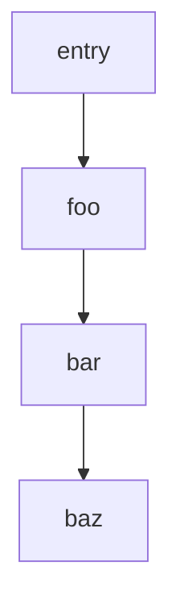
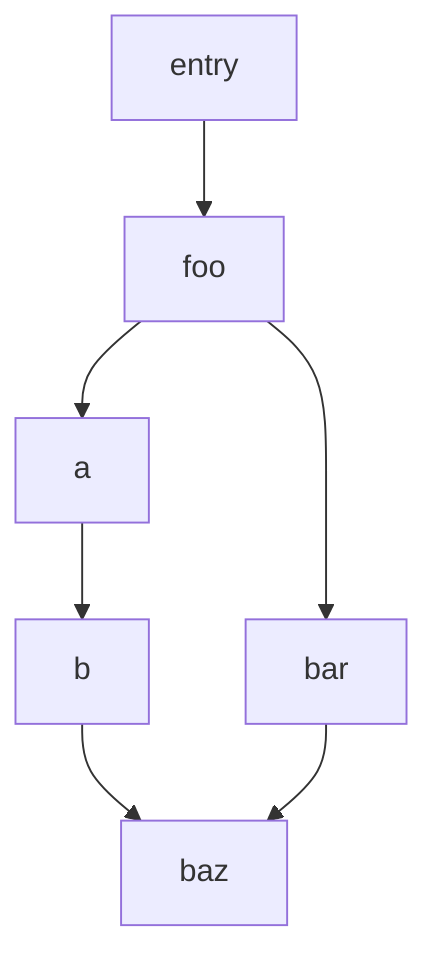
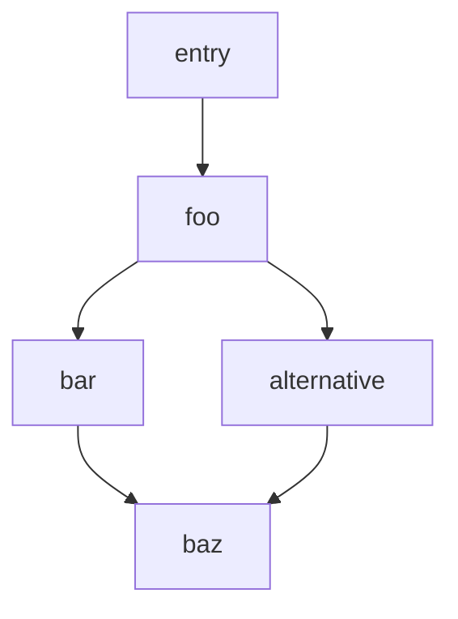
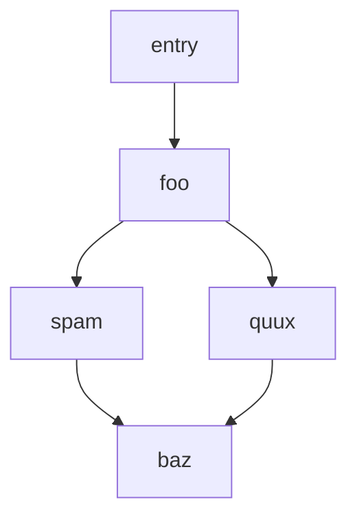

# @endo/path-compare

> [Shortlex](https://en.wikipedia.org/wiki/Shortlex_order)-based comparison of string arrays

## Overview

This is used by [@endo/compartment-mapper][] when crawling a `node_modules` directory to find the shortest _path_ to any given transitive dependency from the entry package.

### Example

Given a dependency tree like this:



The computed _path_ from `entry` to `baz` is `['foo', 'bar', 'baz']`.

If we have another dependency tree like this:



The computed _path_ from `entry` to `baz` is again `['foo', 'bar', 'baz']`, because that has fewer elements than `['foo', 'a', 'b', 'baz']`.

If we have yet another dependency tree like this:



The computed _path_ from `entry` to `baz` is again `['foo', 'bar', 'baz']`. This is because while `['foo', 'alternative', 'baz']` is another path with the same array length, the algorithm _must_ choose one, and so chooses the one with the fewest cumulative characters.

And if we have a tree like this:



The computed path from `entry` to `baz` is `['foo', 'quux', 'baz']`. Both the array length and cumulative character counts are the same. `['foo', 'quux', 'baz']` is lexicographically "before" `['foo', 'spam', 'baz']` (at the first code unit of each array's second element).

> Note: the "lexicographic" comparison uses the UTF-16 code unit order, and thus may be surprising.

## Usage

This package exports `pathCompare`.

### `pathCompare(a?: string[], b?: string[]) => number`

Compares two arrays of strings (if provided) and returns a numeric comparison result: 0 if they are equal, -1 if `a` is "less than" `b`, and 1 if `a` is "greater than" `b` (where "less than" means having fewer elements, or the same element count but a shorter cumulative length, or the same element count and cumulative length but prior when comparing each element lexicographically by UTF-16 code unit).  

```js
import { pathCompare } from '@endo/path-compare';

const path1 = ['foo', 'bar', 'baz'];
const path2 = ['foo', 'quux', 'baz'];

const result = pathCompare(path1, path2); // -1
```

## License

Copyright (c) 2021 Endo Project Contributors. Licensed Apache-2.0

[@endo/compartment-mapper]: https://github.com/endojs/endo/tree/main/packages/compartment-mapper
