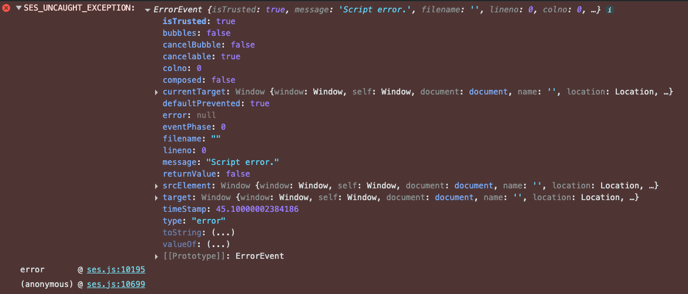

# repro

---

# errorTrapping default
In ses/src/test/error/issue-2941/test1/
1. open error-trapping-default.js in the browser as file:// protocol
2. see

Brave (likely all Chromium):



FireFox (stale needs retesting):
```
SES_UNCAUGHT_EXCEPTION: undefined ses.js:9178:27
    levelMethod file:///.../test1/ses.js:9178
    tameConsole file:///.../test1/ses.js:9618
```

---

# `errorTrapping: 'none'`
In ses/src/test/error/issue-2941/test1/
1. open error-trapping-none.js in the browser as file:// protocol
2. see

Brave (likely all Chromium):


FireFox (needs sampling):
```
SES_UNCAUGHT_EXCEPTION: undefined ses.js:9178:27
    levelMethod file:///.../test1/ses.js:9178
    tameConsole file:///.../test1/ses.js:9618
```
