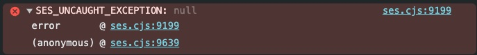
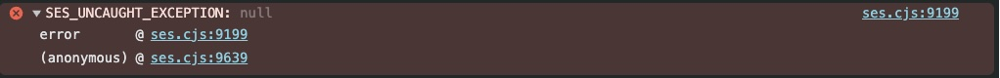
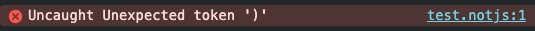

# Repro browser behavior

If relevant, first `yarn build` in the ancestral `ses` directory above.

---

## `errorTrapping: 'platform'`

In ses/src/test/error/issue-2941/test1/
1. open error-trapping-platform.js in the browser using `file://` protocol
2. see

Brave (likely all Chromium):



FireFox (TODO):
```
???
```

---

## `errorTrapping: 'platform', errorTaming: 'safe'`

In ses/src/test/error/issue-2941/test1/
1. open error-trapping-platform-safe.js in the browser using `file://` protocol
2. see

Brave (likely all Chromium):



FireFox (TODO):
```
???
```

---

## `errorTrapping: 'none'`

In ses/src/test/error/issue-2941/test1/
1. open error-trapping-none.js in the browser using `file://` protocol
2. see

Brave (likely all Chromium):



FireFox (TODO):
```
???
```
