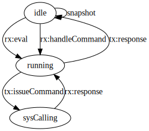

# xsnap

Xsnap is a utility for taking resumable snapshots of a running JavaScript
worker, using Moddable’s XS JavaScript engine.

Xsnap provides a Node.js API for controlling Xsnap workers.

```js
const worker = xsnap();
await worker.evaluate(`
  // Incrementer, running on XS.
  function handleCommand(message) {
    const number = Number(String.fromArrayBuffer(message));
    return ArrayBuffer.fromString(String(number + 1));
  }
`);
await worker.snapshot('bootstrap.xss');
await worker.close();
```

Some time later, possibly on a different computer…

```js
const decoder = new TextDecoder();
const worker = xsnap({ snapshot: 'bootstrap.xss' });
const response = await worker.issueCommand('1');
console.log(decoder.decode(response)); // 2
await worker.close();
```

The parent and child communicate using "commands".

- The XS child uses the synchronous `issueCommand` function to send a request
  and receive as response from the Node.js parent.
- The XS child can implement a synchronous `handleCommand` function to respond
  to commands from the Node.js parent.
  - The XS child `handleCommand` may be asynchronous after a fashion: it
    may return an object and, before the promise queue becomes empty,
    set the `result` property of this object to an `ArrayBuffer`.
    See the **evaluate and report** test for an example.
- The Node.js parent uses an asynchronous `issueCommand` method to send a
  request and receive a response from the XS child.
- The Node.js parent can implement an asynchronous `handleCommand` function to
  respond to commands from the XS child.



# xsrepl

With `xsnap` comes an `xsrepl` command line tool.
Use `yarn global add @agoric/xsnap` to add `xsrepl` to your path.
During development, run `yarn repl`.

The REPL supports special commands `load` and `save` for snapshots, and `quit`
to quit.
Load and save don't take arguments; just type the file name on the next prompt.

```sh
$ xsrepl
xs> globalThis.x = 42;
xs> x
42
xs> save
file> temp.xss
xs> quit
```

```sh
$ xsrepl
xs> load
file> temp.xss
xs> x
42
xs> quit
```
